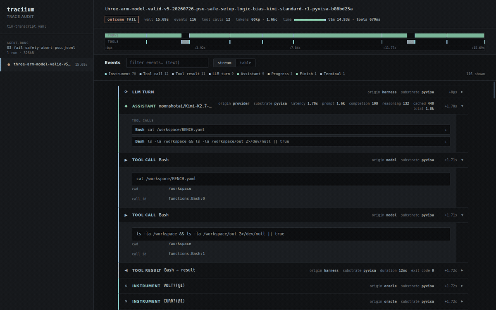

# traciium

A lightweight, Rust-based viewer for **agentic traces** stored as `.jsonl` —
LLM turns, tool calls, tool results, instrument bus traffic, terminal state —
built for quickly answering the questions that matter when debugging agents:

- *Where did things go wrong (or right)?*
- *Where is the agent's time actually going?*
- *What did the model actually read and do?*

```
┌────────────┬──────────────────────────────────────────────────────────┐
│ files/runs │  outcome · wall time · events · tokens · llm-vs-tool time │
│ sidebar    ├──────────────────────────────────────────────────────────┤
│ with       │  timeline: colour-coded spans of where time went          │
│ pass/fail  ├──────────────────────────────────────────────────────────┤
│ dots       │  filter bar · stream / table views                        │
│            │  colour-coded event cards with syntax highlighting        │
└────────────┴──────────────────────────────────────────────────────────┘
```



## Installation

Prerequisite: [Rust](https://rustup.rs/) with Cargo. The web viewer additionally
requires a modern browser.

Install the latest version directly from GitHub in one line:

```sh
cargo install --git https://github.com/labiium/traciium
```

Generate a format file from your own traces, then run the viewer:

```sh
traciium init /path/to/traces --output format.yaml
traciium format.yaml /path/to/traces
```

The executable has no external runtime dependencies. If you cloned the
repository, ready-made format files are available under `formats/`.

## Usage

```sh
traciium format.yaml <path>          # keyboard-first terminal viewer (default)
traciium --web format.yaml <path>    # start the web viewer
                                     # path = one .jsonl file, or a directory
                                     # (scanned recursively for *.jsonl)
traciium inspect <path>              # discover fields and event types
traciium inspect <path> --json       # machine-readable profile for agents
traciium guide info                  # plain-language workflow for agents
traciium guide prompt                # copy/paste agent instructions
traciium guide format                # complete format.yaml reference
```

Options:

| flag       | default   | meaning                                   |
|------------|-----------|-------------------------------------------|
| `--host`   | `0.0.0.0` | bind address (reachable from other hosts) |
| `--port`   | `8787`    | bind port                                 |
| `--open`   | off       | open the browser after startup            |
| `--web`    | off       | use the web viewer instead of the terminal |

### Demo

A self-contained sample trace is included in `demo/sample.jsonl`:

```sh
traciium --web formats/generic.yaml demo/sample.jsonl --open
```

Then open `http://localhost:8787/`. Deep links: `#table` opens the table view,
`#run=<id-substring>` jumps straight to a run.

## Views

- **Stream** — one card per event: icon, label, title, duration/token badges,
  and a body rendered per the format config (markdown for assistant text,
  syntax-highlighted code for commands, key–value rows for the rest).
  Tool results are joined to their calls by `call_id`. Click a card to
  expand/collapse.
- **Table** — a flat, scannable grid with columns chosen by the format config;
  timestamps humanized, success/failure chips colourized, failing rows tinted.
  Click a row to jump to that event in the stream.
- **Timeline** — proportional colour-coded spans (LLM latency, tool execution,
  idle gaps). The legend aggregates time by tone; the header chip shows the
  `llm vs tools` split. Click any span to jump to the event.

- **TUI** — a keyboard-first two-pane reader for terminals and SSH sessions. Run without `--web` and use `j/k` to move or scroll expanded detail, `h/l` to switch Runs/events panes, Tab to switch formatted/JSON detail, `b` to collapse the Runs pane, `/` to search the focused pane (event detail, current run events, or all runs/files), `:N` + Enter to jump to event N (or a detail line while expanded), `g g`/`G` to jump, Enter to expand detail, `c/C` to collapse/expand folders, `r` to refresh traces, `Tab`/`R` to switch formatted/JSON detail, and `q` to quit. Long code, markdown, output, and JSON fields include line numbers.

Filters: free-text (matches anywhere in the event JSON) plus per-type toggles
with counts.

## format.yaml

The format file tells traciium how to read and present *your* trace schema.
Everything is optional except pointing `trace.type_field` at the right key.
Start from `formats/generic.yaml`, or copy a schema-specific one:

| file                          | for                                          |
|-------------------------------|----------------------------------------------|
| `formats/tim-transcript.yaml` | TIM agent transcripts (`t` discriminator)    |
| `formats/tim-monitor.yaml`    | TIM monitor/audit trails (`event` discriminator) |
| `formats/generic.yaml`        | any JSONL, zero per-event config             |

Full schema (all keys optional unless noted):

```yaml
trace:
  type_field: t              # required-ish: key holding the event type
  timestamp_field: ts        # unix seconds (number) or ISO-8601 string
  sequence_field: sequence   # optional ordering / deep-link ids
  run_field: run_id          # optional: group a file's records into runs
  duration_field: my_ms      # optional: global duration fallback (ms)

events:                      # keyed by the value of type_field
  tool_call:
    label: Tool call         # header label (default: type with spaces)
    icon: "▶"                # glyph shown in the header
    tone: sky                # palette tone or raw "#rrggbb"
    open: true               # body expanded by default?
    compact: false           # render as slim separator, not a full card
    slim: true               # one-line tone-tinted band (header only)
    weight: bold             # emphasised left border
    title_from: name         # field used as the card title
    badges: [duration_ms]    # extra header chips
    duration_field: my_ms    # ms field -> drawn as a timeline span
    terminal: true           # marks run outcome (with outcome spec below)
    body:                    # field -> renderer, in display order
      arguments: tool_args
      notes: markdown

defaults:
  ignore: [schema_version]   # fields never rendered in the stream view
  open: false                # default card state
  max_text: 20000            # inline text cap (then a "show all" link)
  header_fields: [origin]    # fields promoted to header chips on all cards

timeline:                    # event type -> ms field, for time accounting
  llm_response: latency_ms
  tool_result: duration_ms

table:
  columns: [ts, event, ok]   # dot-paths allowed, e.g. usage.total
  labels: {ts: time}
  max_cell: 120

value_styles:                # chip colouring per field value ("true"/"false"
  success:                   # for booleans; strings match exactly)
    "true":  { tone: emerald, label: PASS }
    "false": { tone: red, label: FAIL, prefix: "! " }
  shield.decision:           # dot-paths work here too
    blocked: { tone: red }

conditional_styles:          # whole-card styles; first match wins
  - when: {t: terminal, success: false}
    style: {tone: red, weight: bold}
  - when: {t: tool_result, ok: false}
    style: {tone: red}

outcome:                     # how to decide the pass/fail dot per run
  when: {t: terminal}        # last event matching all `when` fields wins
  field: success             # boolean field on that event
```

### Body renderers

| renderer     | use for                                                     |
|--------------|-------------------------------------------------------------|
| `markdown`   | assistant prose (headings, lists, code fences, links)        |
| `code`       | source/config text; language auto-detected or via opts       |
| `output`     | tool stdout/stderr — plain monospace, wrapped                |
| `tool_args`  | smart tool-argument display: primary payload (`command`, `code`, `script`, `query`, …) as highlighted code, the rest as key–value rows |
| `tool_calls` | an `llm_response.tool_calls` array                           |
| `tool_calls_brief` | one-line summary per call (click to jump to the tool_call card) — avoids rendering the same args twice |
| `messages`   | an `llm_request.messages` chat array with role tags          |
| `tokens`     | a `usage` object → compact prompt/completion chips           |
| `kv`         | nested objects as key–value rows                             |
| `list`       | arrays as chips (flags like `critical`, `suspicious`)        |
| `json`       | pretty-printed highlighted JSON                              |
| `text`       | plain text, honouring `value_styles`                         |

Syntax highlighting (bash, python, json, yaml) and markdown rendering are
built in — no external CDN, works fully offline.

### Tones

Named tones: `violet sky emerald amber cyan pink lime orange blue rose red
green slate zinc`. Unknown event types get a stable palette colour
automatically, so the generic format is still readable.

## Building

```sh
cargo build --release      # binary at target/release/traciium
```

The web UI (HTML/CSS/JS, zero frameworks) is embedded in the binary.

## Layout

```
src/main.rs     CLI, file discovery, startup
src/profile.rs  trace profiling + starter format generation
src/format.rs   format.yaml model (serde) + tone defaults
src/trace.rs    JSONL parsing, run grouping, stats, timeline spans
src/server.rs   axum routes (embedded UI + JSON endpoints)
web/            embedded single-page viewer (vanilla JS/CSS)
formats/        ready-made format configs for TIM traces + generic
```

## License

Copyright © 2026 Emmanuel Olowe. Licensed under the [Apache License, Version
2.0](LICENSE).
